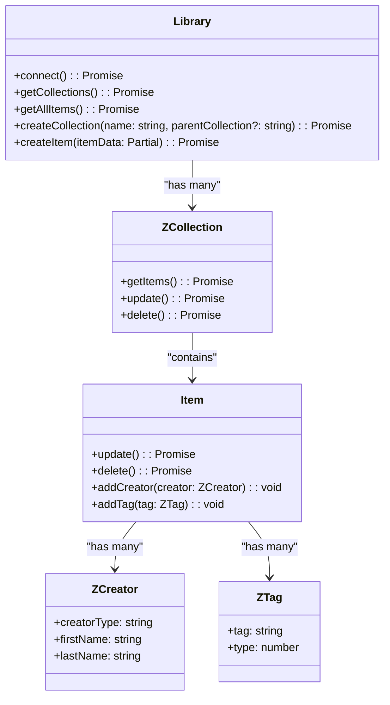

# Zotero-TS-API

## Introduction
Zotero-TS-API is a TypeScript library that provides an intuitive interface for interacting with the Zotero API. Zotero is a reference management platform used by researchers, students, and professionals to organize their sources. This library allows you to manage libraries, collections, items, tags, and creators directly via API calls.

### Key Features:
Connect to a Zotero library (user or group).
Manage collections: create, update, delete, and retrieve.
Manage items: create, update, delete, and retrieve.
Manipulate metadata: creators and tags.
Quick Start

## Installation
Ensure you have Node.js installed, then install the library via npm:
```bash
npm install zotero-ts-api
```

## Configuration
Create a `.env` file at the root of your project to store your Zotero credentials:
```bash
ZOTERO_API_KEY=your_api_key
ZOTERO_GROUP_ID=your_group_id
```

## Example Usage
Here is a simple example to connect to a Zotero library and retrieve collections and items:
```typescript
import { config } from 'dotenv';
import { Library } from 'zotero-ts-api';

// Load environment variables
config();

const apiKey = process.env.ZOTERO_API_KEY;
const groupId = process.env.ZOTERO_GROUP_ID;
const libraryType = 'groups'; // or 'users', then use a user API Key

(async () => {
  const library = new Library(apiKey, id, type);
  await library.connect();

  console.log(`Connected to library: ${library.name}`);

  const collections = await library.getCollections();
  console.log(`Found ${collections.length} collections`);

  const items = await library.getAllItems();
  console.log(`Found ${items.length} items`);

  items.forEach(item => {
    console.log(`Item Key: ${item.key}`);
    console.log(`Title: ${item.title}`);
    console.log(`Item Type: ${item.itemType}`);
    // item.delete(); // Suppression de l'élément    
  });
})();
```
## References
### Main Classes
`Library`

Represents a Zotero library.

- Constructor :
```typescript
constructor(apiKey: string, libId: string, libraryType: 'users' | 'groups')
```

- Methods:
    - connect(): Promise<void>: Connect to the library.
    - getCollections(): Promise<ZCollection[]>: Retrieve all collections.
    - getAllItems(): Promise<Item[]>: Retrieve all items.
    - createCollection(name: string, parentCollection?: string): Promise<ZCollection>:     - Create a new collection.
    - createItem(itemData: Partial<IItemData>): Promise<Item>: Create a new item.
    - getTags(): Promise<string[]>: Retrieve all tags in the library.

---
`ZCollection`

Represents a collection in Zotero.
- Constructor
```typescript
constructor(data: ICollectionData, apiKey: string, id: string, type: 'users' | 'groups')
```
- Methods:
    - getItems(): Promise<Item[]>: Retrieve items in the collection.
    - update(): Promise<void>: Update the collection.
    - delete(): Promise<void>: Delete the collection.

---

`Item`

Represents an item (bibliographic reference).

- Constructor
```typescript
constructor(data: IItemData, apiKey: string, id: string, type: 'users' | 'groups')
```

- Methods:
    - update(): Promise<void>: Update the item.
    - delete(): Promise<void>: Delete the item.
    - addCreator(creator: ZCreator): void: Add a creator.
    - addTag(tag: ZTag): void: Add a tag.
---
`ZCreator`

Represents a creator (author, editor, etc.).

- Constructor :
```typescript
constructor(data: ICreatorData)
```
---
`ZTag`

Represents a tag associated with an item.

- Constructor :
```typescript
constructor(data: ITagData)
```
---
Below is a diagram illustrating the relationships between the main entities:


    
