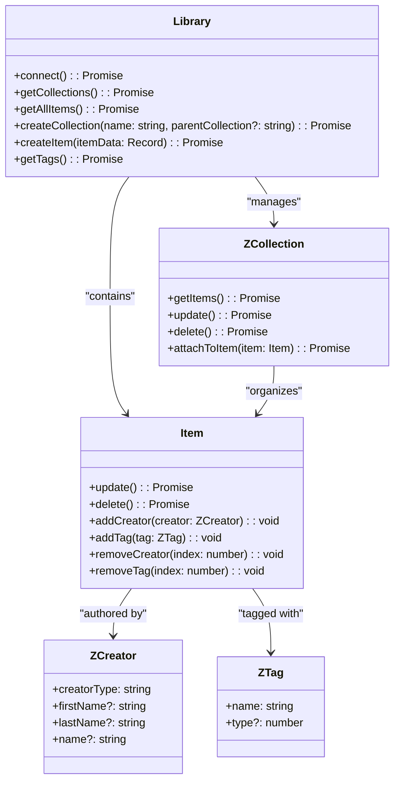

# Zotero-TS-API

A modern TypeScript wrapper for the Zotero Web API that provides type-safe access to your Zotero libraries, collections, and items.

## Features

- 🔒 **Type-safe**: Full TypeScript support with comprehensive type definitions
- 🚀 **Modern**: Built with ES2020+ features and async/await
- 📚 **Complete**: Supports users and groups libraries
- 🛠️ **CRUD Operations**: Create, read, update, and delete items and collections
- 🏷️ **Metadata Management**: Handle creators, tags, and bibliographic data
- ✅ **Tested**: Comprehensive test suite with high coverage
- 📖 **Well-documented**: Extensive JSDoc comments and examples

## Installation

```bash
npm install zotero-ts-api
```

## Quick Start

### Configuration

Create a `.env` file in your project root:

```bash
ZOTERO_API_KEY=your_api_key_here
ZOTERO_USER_ID=your_user_id  # For user libraries
ZOTERO_GROUP_ID=your_group_id  # For group libraries
```

### Basic Usage

```typescript
import { config } from 'dotenv';
import { Library } from 'zotero-ts-api';

// Load environment variables
config();

const apiKey = process.env.ZOTERO_API_KEY!;
const userId = process.env.ZOTERO_USER_ID!;

(async () => {
  // Connect to a user library
  const library = new Library(apiKey, userId, 'users');
  await library.connect();

  console.log(`Connected to library: ${library.name}`);

  // Get all collections
  const collections = await library.getCollections();
  console.log(`Found ${collections.length} collections`);

  // Get all items
  const items = await library.getAllItems();
  console.log(`Found ${items.length} items`);

  // Display items
  items.forEach(item => {
    console.log(`- ${item.title} (${item.itemType})`);
  });
})();
```

### Working with Groups

```typescript
const groupId = process.env.ZOTERO_GROUP_ID!;
const groupLibrary = new Library(apiKey, groupId, 'groups');
await groupLibrary.connect();
```

## API Reference

### Library Class

The main entry point for interacting with Zotero libraries.

```typescript
const library = new Library(apiKey: string, libId: string, libraryType: 'users' | 'groups');
```

#### Methods

- **`connect(): Promise<void>`** - Establishes connection to the library
- **`getCollections(): Promise<ZCollection[]>`** - Retrieves all collections
- **`getAllItems(): Promise<Item[]>`** - Retrieves all items
- **`createCollection(name: string, parentCollection?: string): Promise<ZCollection>`** - Creates a new collection
- **`createItem(itemData: Record<string, unknown>): Promise<Item>`** - Creates a new item
- **`getTags(): Promise<string[]>`** - Retrieves all tags

#### Properties

- **`name?: string`** - Library name (available after connection)
- **`id?: number`** - Library ID (available after connection)
- **`type?: string`** - Library type (available after connection)

### ZCollection Class

Represents a Zotero collection with full CRUD operations.

```typescript
const collection = new ZCollection(data: ICollectionData, apiKey: string, id: string, type: 'users' | 'groups');
```

#### Methods

- **`getItems(): Promise<Item[]>`** - Retrieves items in the collection
- **`update(): Promise<void>`** - Updates the collection
- **`delete(): Promise<void>`** - Deletes the collection
- **`attachToItem(item: Item): Promise<void>`** - Attaches an item to this collection

#### Properties

- **`key: string`** - Collection key
- **`name: string`** - Collection name (getter/setter)
- **`parentCollection?: string`** - Parent collection key (getter/setter)

### Item Class

Represents a bibliographic item with full CRUD operations.

```typescript
const item = new Item(data: IItemData, apiKey: string, id: string, type: 'users' | 'groups');
```

#### Methods

- **`update(): Promise<void>`** - Updates the item
- **`delete(): Promise<void>`** - Deletes the item
- **`addCreator(creator: ZCreator): void`** - Adds a creator
- **`removeCreator(index: number): void`** - Removes a creator by index
- **`addTag(tag: ZTag): void`** - Adds a tag
- **`removeTag(index: number): void`** - Removes a tag by index

#### Properties

- **`key: string`** - Item key
- **`title: string`** - Item title (getter/setter)
- **`itemType: string`** - Item type (getter/setter)
- **`url?: string`** - Item URL (getter/setter)
- **`abstractNote?: string`** - Abstract (getter/setter)
- **`date?: string`** - Date (getter/setter)
- **`language?: string`** - Language (getter/setter)
- **`collections: string[]`** - Collection keys (getter)
- **`tags: ZTag[]`** - Tags array (getter)
- **`creators: ZCreator[]`** - Creators array (getter)

### ZCreator Class

Represents a creator (author, editor, etc.).

```typescript
const creator = new ZCreator(data: ICreatorData);
```

#### Properties

- **`creatorType: string`** - Creator type (author, editor, etc.)
- **`firstName?: string`** - First name (for individuals)
- **`lastName?: string`** - Last name (for individuals)
- **`name?: string`** - Single name (for organizations)

### ZTag Class

Represents a tag associated with an item.

```typescript
const tag = new ZTag(data: ITagData);
```

#### Properties

- **`name: string`** - Tag name (getter/setter)
- **`type?: number`** - Tag type (getter/setter)

## Examples

### Creating Items

```typescript
// Create a journal article
const article = await library.createItem({
  title: 'The Impact of TypeScript on Modern Development',
  itemType: 'journalArticle',
  publicationTitle: 'Journal of Software Engineering',
  date: '2024-01-15',
  pages: '1-15',
  DOI: '10.1000/example.doi',
  url: 'https://example.com/article'
});

console.log(`Created article: ${article.title}`);
```

### Working with Collections

```typescript
// Create a collection
const collection = await library.createCollection('Research Papers');

// Create a subcollection
const subcollection = await library.createCollection(
  'TypeScript Studies', 
  collection.key
);

// Get items in a collection
const items = await collection.getItems();
console.log(`Collection has ${items.length} items`);
```

### Managing Creators and Tags

```typescript
import { ZCreator, ZTag } from 'zotero-ts-api';

// Add creators to an item
const author = new ZCreator({
  creatorType: 'author',
  firstName: 'John',
  lastName: 'Doe'
});

const editor = new ZCreator({
  creatorType: 'editor',
  name: 'Academic Press'
});

item.addCreator(author);
item.addCreator(editor);

// Add tags
const tag1 = new ZTag({ tag: 'typescript' });
const tag2 = new ZTag({ tag: 'programming', type: 1 });

item.addTag(tag1);
item.addTag(tag2);

// Save changes
await item.update();
```

## Error Handling

The library throws descriptive errors for common scenarios:

```typescript
try {
  await library.connect();
} catch (error) {
  if (error.message.includes('403')) {
    console.error('Invalid API key or insufficient permissions');
  } else if (error.message.includes('404')) {
    console.error('Library not found');
  } else {
    console.error('Connection failed:', error.message);
  }
}
```

## TypeScript Support

The library is built with TypeScript and provides comprehensive type definitions:

```typescript
import type { 
  IItemData, 
  ICollectionData, 
  ICreatorData, 
  ITagData 
} from 'zotero-ts-api';

// All interfaces are exported for custom implementations
```

## Development

### Building

```bash
npm run build
```

### Testing

```bash
npm test                # Run tests
npm run test:watch      # Watch mode
npm run test:coverage   # Coverage report
npm run test:ui         # Visual test interface
```

### Linting

```bash
npm run lint            # Check and fix code style
npm run format          # Format with Prettier
npm run type-check      # TypeScript type checking
```

## Architecture



## Contributing
Feel free to contribute. Here are the main points I want to improve:
- Add files (pdf, png, ...)
- Automatic abstract (useful ?)

## License

MIT License - see [LICENSE](LICENSE) file for details.

## Links

- [Zotero Web API Documentation](https://www.zotero.org/support/dev/web_api/v3/start)
- [NPM Package](https://www.npmjs.com/package/zotero-ts-api)
- [GitHub Repository](https://github.com/votre-username/Zotero-TS-API)

